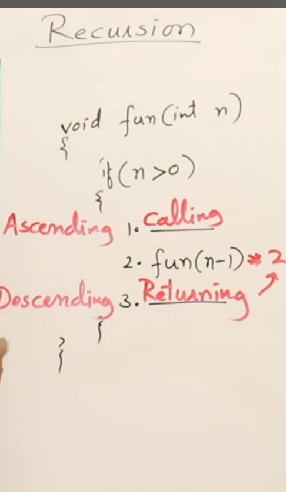

#### 🔹 **What is Recursion?**

Recursion is an important concept where functions call themselves to solve problems. Recursive functions can replace iterative procedures and are useful for simplifying complex problems.

---

#### 🔹 **Topics Covered in This Lesson**

1. What is recursion?
2. Tracing a recursive function
3. Understanding how recursion uses a stack
4. Time complexity of recursive functions

---

#### 🔹 **How Function Calls Work**

Before diving into recursion, a reminder:

- A `main()` function can call another function, say `fun()`.
- When `fun()` is called:

  - Control moves to `fun()`.
  - Once it completes, control returns to the calling line.
  - If there’s a return value being used (like `fun() * 2`), that expression is evaluated after the function returns.

---

#### 🔹 **What is a Recursive Function?**

- A function that **calls itself** is called **recursive**.
- Every recursive function must have a **base condition** to stop further calls.
- Without a base condition, it can go into **infinite recursion**.

---

#### 🔹 **Example 1: Printing Numbers in Decreasing Order**


```c
void fun1(int n) {
    if (n > 0) {
        printf("%d ", n);
        fun1(n - 1);
    }
}
```

- Call: `fun1(3)`

- Trace:

  - fun1(3) → prints 3 → calls fun1(2)
  - fun1(2) → prints 2 → calls fun1(1)
  - fun1(1) → prints 1 → calls fun1(0)
  - fun1(0) → base condition met → stop

- **Output:** `3 2 1`

---

#### 🔹 **How Recursive Calls Work (Stack Visualization)**

- Each call waits for the next to finish.
- Calls are added to the stack.
- When the base condition is reached, the stack starts **unwinding**.

---

#### 🔹 **Example 2: Printing Numbers in Increasing Order**


```c
void fun2(int n) {
    if (n > 0) {
        fun2(n - 1);
        printf("%d ", n);
    }
}
```

- Call: `fun2(3)`

- Trace:

  - fun2(3) → calls fun2(2)
  - fun2(2) → calls fun2(1)
  - fun2(1) → calls fun2(0)
  - fun2(0) → base condition met → return
  - Then prints: 1 → 2 → 3

- **Output:** `1 2 3`

---

#### 🔹 **Comparison of the Two Examples**


| Feature          | `fun1()` (Decreasing) | `fun2()` (Increasing) |
| ---------------- | --------------------- | --------------------- |
| Print happens... | Before recursive call | After recursive call  |
| Output order     | Top-down (3 2 1)      | Bottom-up (1 2 3)     |
| Printing time    | At call time          | At return time        |

---

#### 🔹 **Real-Life Analogy: Nested Rooms**

Imagine 3 rooms inside each other. Each has a bulb. You're told:

1. Switch on the bulb.
2. Go to the next room.

If you follow the **fun1()** logic:

- You switch on the bulb **before** going to the next room.
- Bulbs are switched on in order: Room 1 → Room 2 → Room 3

If you follow **fun2()** logic:

- You go to the last room **first**, then switch bulbs on while **coming back**.
- Bulbs are switched on in order: Room 3 → Room 2 → Room 1

---



Here, I have a recursive function that is calling itself.

There are three statements: the first statement does something, then the function calls itself, and finally, there's one more statement.

So the question is:
**When will each of these statements execute?**

- The **first statement** (before the recursive call) will execute at **calling time**.
- The **statement after** the recursive call will execute at **returning time**.

If there’s anything written **after** the recursive function call — like computations or further code — it will also execute at **returning time**.

---

You can think of this as a **formula**:

- In a recursive function, any code **before** the function call executes during the **ascending phase** (when calls are made).
- Any code **after** the function call executes during the **descending phase** (when calls return).

So we can define:

- **Ascending phase** – when recursive calls are being made.
- **Descending phase** – when recursive calls are returning.

---

**Comparing Recursion with Loops:**

Loops repeat statements, and so does recursion.

- In recursion, the function keeps calling itself — so that’s also repetition.
- But here’s the key difference:

> Loops have **only** an ascending phase.
> Recursion has **both** ascending and descending phases.

That’s the **power of recursion** — this two-phase structure helps simplify certain problems and makes some code easier to write.

---

So remember:

- Recursion has **two phases**: **ascending** (before the call) and **descending** (after the call).
- Loops only have **one phase**.

---

## lets understand how recursion works with a stack.

When a function calls itself, it creates a new frame on the call stack. Each frame contains information about the function call, including parameters and local variables. When the base condition is met, the stack starts unwinding, returning control to the previous frames.


