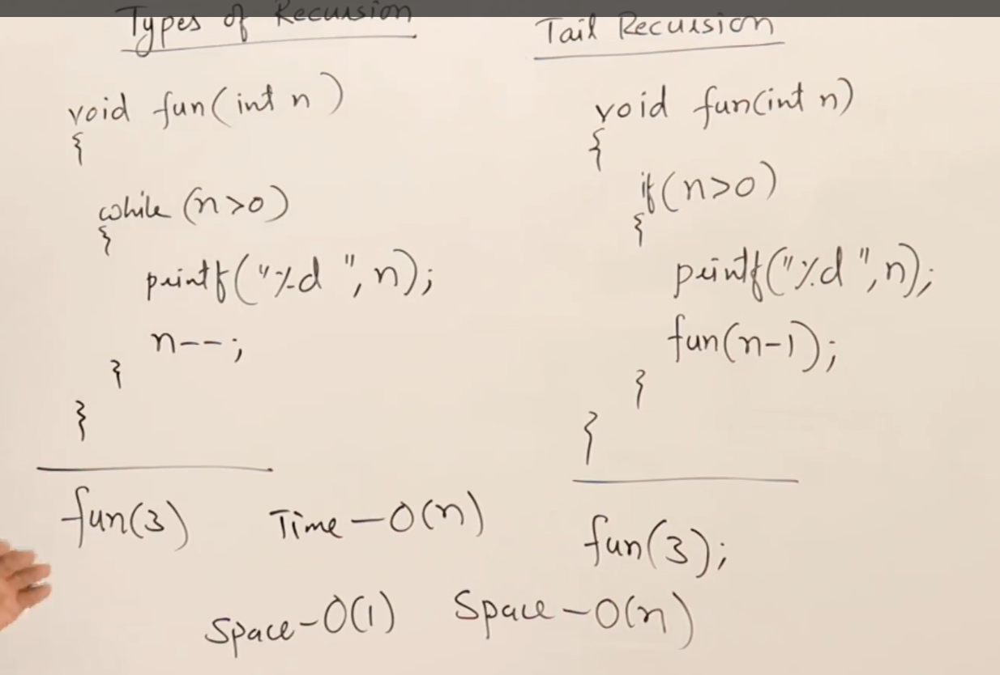
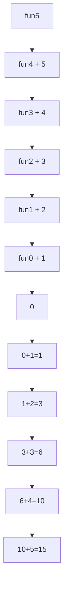
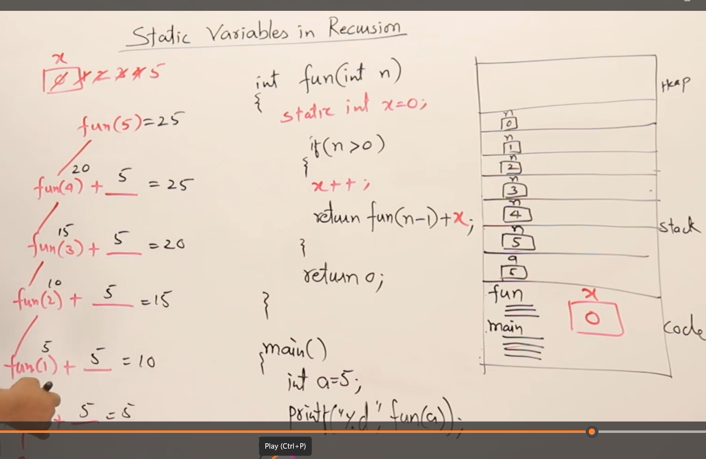
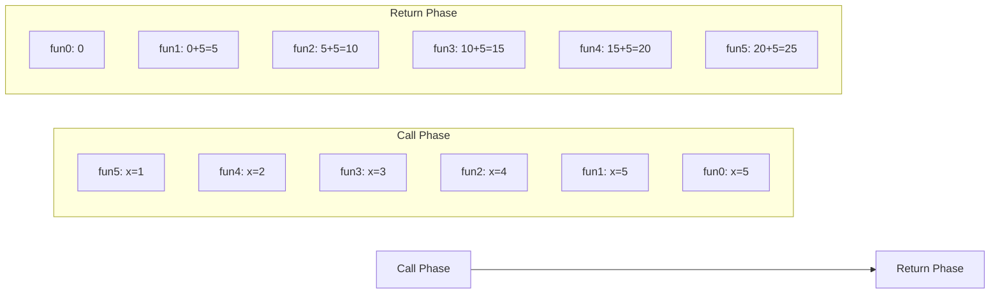

```markdown
# Static Variables in Recursion

## Core Concepts
- **Static variables** have a **single copy** stored in the code section
- Created at program load time (not per function call)
- Preserve values between function calls
- All recursive calls share the same static variable instance
- Global variables behave similarly in recursion

---

## Example 1: Recursion Without Static Variable

```c
int fun(int n) {
    if (n > 0)
        return fun(n - 1) + n;  // Add current n during return
    return 0;
}
```

### Execution Flow (`fun(5)`:

**Result**: 15 (sum of 1-5)

---

## Example 2: Recursion With Static Variable

```c
int fun(int n) {
    static int x = 0;  // Single shared copy
    if (n > 0) {
        x++;           // Modifies shared x
        return fun(n - 1) + x;
    }
    return 0;
}
```

### Execution Flow (`fun(5)`:

**Result**: 25 (each call adds final x-value 5)

---

## Key Differences
| **Aspect**          | Without Static          | With Static             |
|----------------------|-------------------------|-------------------------|
| **Storage**          | Stack (per call)        | Code section (global)   |
| **Copies**           | New per call            | Single shared copy      |
| **Value Behavior**   | Unique per call (n)     | Shared across calls (x) |
| **Result for n=5**   | 15                      | 25                      |

---

## Critical Notes
1. **Static variables persist** across recursive calls
2. **Tracing technique**:
   - Maintain static variables outside recursion tree
   - Track single value throughout execution
3. **When to use**:
   - Counting total recursive calls
   - Accumulating values across recursion levels
4. **Equivalent behavior**:
   - Global variables produce same results as static
5. **Caution**: Shared state can cause unexpected side effects

> **Key Insight**: Static variables act as "global state" for all recursive invocations, while local variables maintain call-specific state.