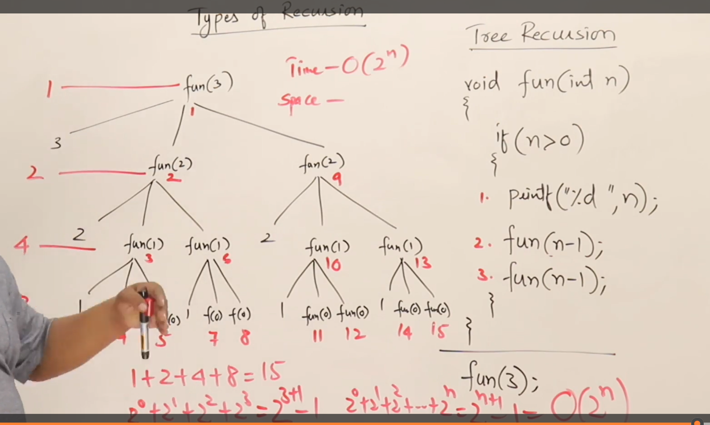
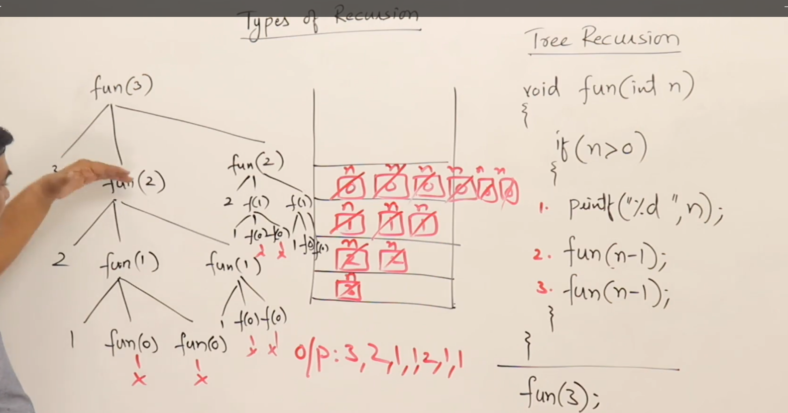
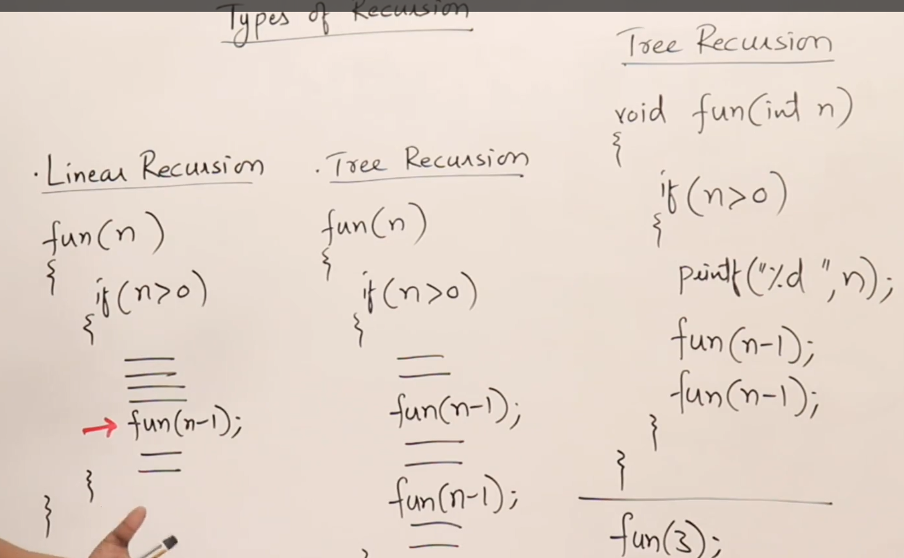
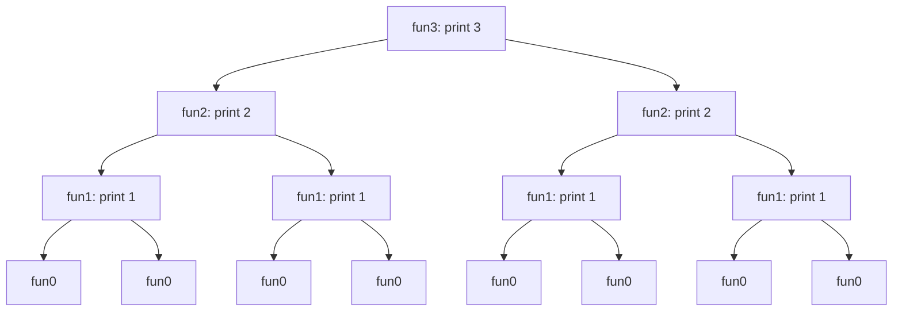
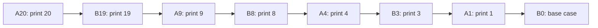

# Types of Recursion

-- **Tail Recursion**
-- **Head Recursion**
-- **Tree Recursion**
-- **Indirect Recursion**
-- **Nested Recursion**

---
**********************************************************************************************************************************************
## 1 Tail Recursion


````markdown
## Definition

- **Tail Recursion**: A recursive function where the **recursive call is the last statement** in the function
- No operations are performed after the recursive call (no returning phase)
- All processing happens during the **calling phase**

### Key Characteristic

```c
void fun(int n) {
    if (n > 0) {
        // Operations performed BEFORE recursive call
        printf("%d ", n);
        fun(n-1);  // Last statement → Tail Recursion
    }
}
```
````

---

## Comparison with Loops

| **Aspect**             | Tail Recursion       | Loop Equivalent       |
| ---------------------- | -------------------- | --------------------- |
| **Time**               | O(n)                 | O(n)                  |
| **Space**              | O(n) (uses stack)    | O(1) (constant space) |
| **Activation Records** | n+1 records          | 1 record              |
| **Efficiency**         | Less space efficient | More space efficient  |

### Loop Conversion

```c
// Tail Recursion
void fun(int n) {
    if (n > 0) {
        printf("%d ", n);
        fun(n-1);
    }
}

// Equivalent Loop
void fun(int n) {
    while (n > 0) {
        printf("%d ", n);
        n--;
    }
}
```

---

## Key Insights

1. **Compiler Optimization**: Modern compilers may convert tail recursion to loops automatically to optimize space
2. **When to Use Loops**: Prefer loops over tail recursion for better space efficiency (O(1) vs O(n))
3. **Limitation**: Only possible when no operations are needed after the recursive call

> **Next Topic**: Head Recursion (recursive call is the FIRST statement in the function)

---
***************************************************************************************************************************************************
## 2 Head Recursion

````markdown
# Types of Recursion: Head Recursion

## Definition

- **Head Recursion**: A recursive function where the **recursive call is the first statement** in the function
- All processing happens **after** the recursive call (during returning phase)
- No operations are performed before the recursive call

### Key Characteristic

```c
void fun(int n) {
    if (n > 0) {
        fun(n-1);      // First statement → Head Recursion
        printf("%d ", n); // Operations AFTER recursive call
    }
}
// Output for fun(3): 1 2 3
```
````

---

## Comparison with Loops

| **Aspect**       | Head Recursion          | Loop Equivalent        |
| ---------------- | ----------------------- | ---------------------- |
| **Execution**    | Operations at returning | Operations in sequence |
| **Conversion**   | Not direct              | Requires restructuring |
| **Output Order** | Reverse of input        | Sequential             |

### Loop Conversion (Non-Direct)

```c
// Head Recursion (Output: 1 2 3)
void fun(int n) {
    if (n > 0) {
        fun(n-1);
        printf("%d ", n);
    }
}

// Equivalent Loop (Output: 1 2 3)
void fun(int n) {
    int i = 1;
    while (i <= n) {
        printf("%d ", i);
        i++;
    }
}
```

---

## Key Insights

1. **No Call-Time Processing**: All operations occur during the **returning phase**
2. **Loop Conversion Complexity**: Requires restructuring (cannot directly mirror recursion structure)
3. **Output Behavior**: Produces output in **reverse order** of Tail recursion
4. **When to Use**: Preferred when operations depend on recursive results (e.g., tree traversals)

> **Next Topic**: Tree Recursion (multiple recursive calls per function)

````markdown
---

***************************************************************************************************************************************************
# 3 Types of Recursion: Tree Recursion





## Definition

- **Tree Recursion**: Occurs when a recursive function makes **more than one call to itself** per invocation
- Generates a tree-like call structure with multiple branches
- Contrast with linear recursion (single call per function)

### Key Characteristic

```c
void fun(int n) {
    if (n > 0) {
        printf("%d ", n);   // Operation
        fun(n-1);           // First recursive call
        fun(n-1);           // Second recursive call
    }
}
// Calls for fun(3): 15 activations
```
````

---

## Execution Analysis (`fun(3)`)

### Tracing Tree & Output



**Output**: `3 2 1 1 2 1 1`  
_(Order: Pre-order traversal of call tree)_

### Key Observations

1. **Total Activations**: 15 for n=3
2. **Call Pattern**:
   - Level 0: 1 call (n=3)
   - Level 1: 2 calls (n=2)
   - Level 2: 4 calls (n=1)
   - Level 3: 8 calls (n=0)
3. **Max Stack Height**: 4 (n+1 levels)

---

## Complexity Analysis

| **Type**        | Complexity | Explanation                                 |
| --------------- | ---------- | ------------------------------------------- |
| **Time**        | O(2ⁿ)      | Total calls = 2⁰ + 2¹ + ... + 2ⁿ = 2ⁿ⁺¹ - 1 |
| **Space**       | O(n)       | Max stack depth = n+1 levels                |
| **Activations** | 2ⁿ⁺¹ - 1   | Geometric series (sum = 2ⁿ⁺¹ - 1)           |

### Formula

- **Total Calls** = 2ⁿ⁺¹ - 1  
  _(e.g., n=3 → 2⁴ - 1 = 15)_
- **Space Usage**: Proportional to tree height (n+1)

---

## Key Insights

1. **Exponential Growth**: Time complexity grows rapidly with n (impractical for large n)
2. **Stack Management**: Space efficient despite many calls (stack frames reused)
3. **When to Use**:
   - Natural for branching problems (e.g., tree traversals, combinatorics)
   - Avoid for linear problems where iterative/linear recursion suffices
4. **Debugging Tip**: Visualize as a binary tree to understand call order

> **Note**: Tree recursion is powerful for divide-and-conquer algorithms but requires careful complexity analysis

---

***************************************************************************************************************************************************
````markdown
# 4 Types of Recursion: Indirect Recursion


## Definition

- **Indirect Recursion**: Multiple functions call each other in a **circular pattern**, forming a recursive cycle
- No function directly calls itself; recursion emerges through mutual function calls
- Requires **conditional checks** in each function to terminate the cycle

### Structure

```c
void A(int n) {
    if (n > 0) {
        printf("%d ", n);
        B(n-1);  // Call function B
    }
}

void B(int n) {
    if (n > 1) {
        printf("%d ", n);
        A(n/2);  // Call back function A
    }
}
```
````

---

## Execution Flow (`A(20)`)



**Output Sequence**: 20 → 19 → 9 → 8 → 4 → 3 → 1

### Key Steps:

1. **Start**: `A(20)` prints `20` → calls `B(19)`
2. **Cycle 1**: `B(19)` prints `19` → calls `A(9)`
3. **Cycle 2**: `A(9)` prints `9` → calls `B(8)`
4. **Cycle 3**: `B(8)` prints `8` → calls `A(4)`
5. **Cycle 4**: `A(4)` prints `4` → calls `B(3)`
6. **Cycle 5**: `B(3)` prints `3` → calls `A(1)`
7. **Termination**: `A(1)` prints `1` → calls `B(0)` (fails condition)

---

## Critical Characteristics

1. **Circular Dependency**:
   - Function A → Function B → Function A (cycle)
2. **Termination Condition**:
   - Each function must have independent base cases (e.g., `n>0` in A, `n>1` in B)
3. **Parameter Transformation**:
   - Parameters modified in each call (e.g., `n-1` in A → `n/2` in B)
4. **Stack Usage**:
   - Activation records alternate between functions (A/B/A/B)
   - Stack depth proportional to number of cycles

---

## When to Use

- **Modular Design**: Break complex recursion into specialized functions
- **State Management**: Different functions handle distinct phases of processing
- **Avoid**: For simple recursions (direct recursion is more efficient)

> **Note**: Indirect recursion can involve >2 functions (A→B→C→A), but each must contribute to cycle termination

```

```

---
****************************************************************************************************************************************************
# 5 Types of Recursion: Nested Recursion


```markdown
# Indirect Recursion

## Definition
- **Indirect recursion**: Multiple functions call each other in a **circular pattern**, forming a recursive cycle
- No function directly calls itself; recursion emerges through mutual calls

### Key Characteristics
1. **Circular Dependency**:  
   Function A → Function B → Function A (cycle continues)
2. **Termination Conditions**:  
   Each function must have its own base case to break the cycle
3. **Parameter Transformation**:  
   Parameters are modified in each call to progress toward base case

---

## Example
```c
void A(int n) {
    if (n > 0) {
        printf("%d ", n);
        B(n - 1);  // Calls function B
    }
}

void B(int n) {
    if (n > 1) {
        printf("%d ", n);
        A(n / 2);  // Calls back function A
    }
}
```

### Execution Flow (`A(20)`):
1. `A(20)` prints `20` → calls `B(19)`  
2. `B(19)` prints `19` → calls `A(9)`  
3. `A(9)` prints `9` → calls `B(8)`  
4. `B(8)` prints `8` → calls `A(4)`  
5. `A(4)` prints `4` → calls `B(3)`  
6. `B(3)` prints `3` → calls `A(1)`  
7. `A(1)` prints `1` → calls `B(0)` (terminates)  

**Output**: `20 19 9 8 4 3 1`

---

## Key Insights
1. **Base Cases**:  
   - `A` terminates when `n <= 0`  
   - `B` terminates when `n <= 1`  
2. **Parameter Modification**:  
   - `A` reduces parameter by 1 (`n-1`)  
   - `B` halves the parameter (`n/2`)  
3. **Stack Behavior**:  
   - Activation records alternate between functions  
   - Stack depth depends on parameter reduction rate  
4. **Termination**:  
   Requires coordinated parameter changes across functions to eventually hit base cases

> **Use Case**: Modularize recursive logic across functions when different processing steps are needed at each recursion level
```